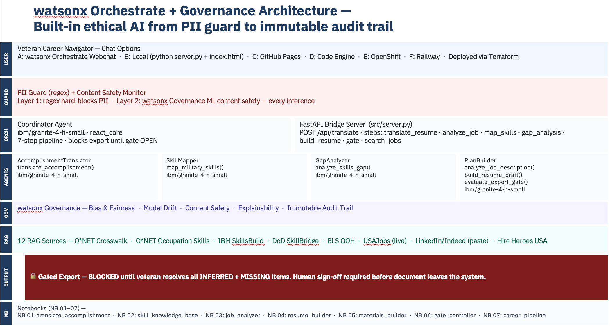
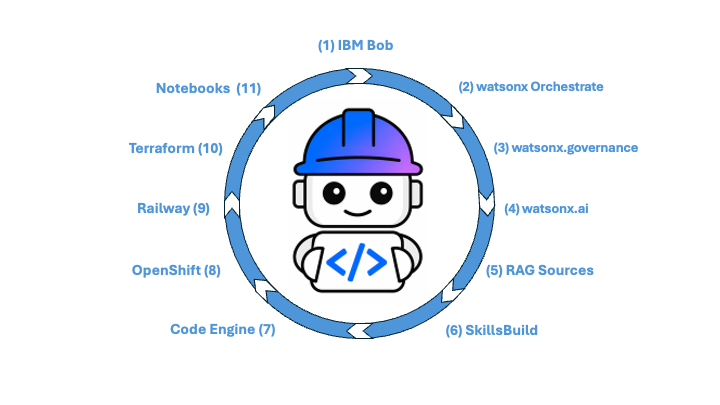

# **Mission Veteran AI** *by G3*

  
  &nbsp;&nbsp;&nbsp;&nbsp;&nbsp;&nbsp;&nbsp;&nbsp;&nbsp;&nbsp;&nbsp;&nbsp;&nbsp;&nbsp;&nbsp;&nbsp;&nbsp;&nbsp;&nbsp;&nbsp;&nbsp;&nbsp;&nbsp;&nbsp;
  

  

Mission Veteran AI (by Golden Gate Glory or G3) is an AI-powered career chatbot, made with IBM Bob, for veterans and transitioning service members with military computer and IT experience.  Veterans describe responsibilities and achievements, the chatbot then identifies transferable skills in computer systems, IT support, data analysis, and cybersecurity, and drafts civilian-ready résumé accomplishments, preserving measurable results and allowing veterans to market their technical experience and improve opportunities to obtain civilian jobs.

 <a href="docs/problem.md">Problem and Solution</a> &nbsp;&nbsp; | &nbsp;&nbsp; <a href="docs/technology.md">Technology Used</a>

  

  

| Index | Product | Description | 
| :---: | :---:   | :---:       |
| 1 | [IBM Bob](docs/ibmbob.md) | Development assistant throughout. |
| 2 | [watsonx Orchestrate](docs/watsonxorchestrate.md) | Coordinator agent, four subagents, four toolkits. | 
| 3 | [watsonx.governance](docs/watsonxgovernance.md) | Monitoring, Drift Detection, Content Safety, Explainability, Audit Trail. |
| 4 | [watsonx.ai](docs/watsonxai.md) | Model host and REST inference API. |
| 5 | [Granite & RAG](docs/granite.md) | Granite usage and RAG  sources including SkillsBuild. |
| 6 | [UI Screens](docs/screens.md) | Detailed descriptions of each screen. |
| 7 | [Local Execution](docs/local.md) | Option B for FastAPI bridge server locally. |
| 8 | [GitHub Pages](docs/pages.md) | Option C for static CDN deployment. |
| 9 | [Code Engine](docs/codeengine.md) | Option D for FastAPI bridge server container. |
| 10 | [OpenShift](docs/openshift.md) | Option E for FastAPI bridge server container. |
| 11 | [Railway](docs/railway.md) | Option F for FastAPI bridge server container. |
| 12 | [Terraform](docs/terraform.md) | Deployment via Terraform. |
| 13 | [Notebooks](docs/notebooks.md) | Seven Jupyter notebooks for standalone step testing. |
| 14 | [Diagrams](docs/diagrams.md) | Full architecture and dual environments. |

---

# License

This application is licensed under the Apache License, Version 2.  Separate third-party code objects invoked by this application are licensed by their respective providers pursuant to their own separate licenses.  Contributions are subject to the [Developer Certificate of Origin, Version 1.1](https://developercertificate.org/) and the [Apache License, Version 2](https://www.apache.org/licenses/LICENSE-2.0.txt).

