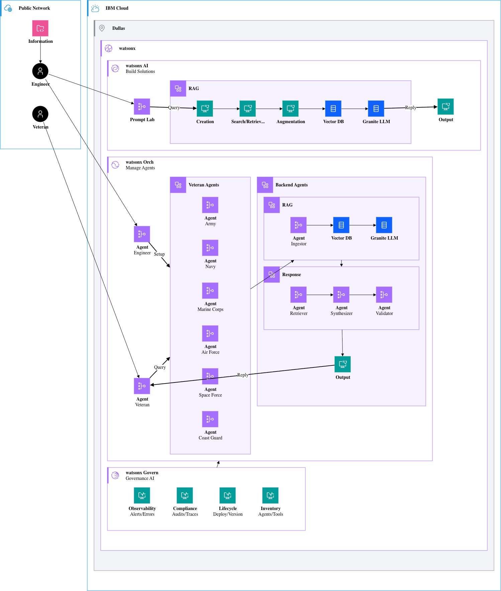

# **Golden Gate Glory - IBM AI Lab Challenge**

### Problem Description

An AI-supported tool to help veterans and transitioning service members translate military experience into civilian career language, identify transferable skills, prepare resume and interview materials, and connect training goals to employment pathways.

### Solution Description

### Solution Diagram

### Technology Used

### References

- [Diagram Source](source/synthmed.py)
- [Diagram Standard](https://www.ibm.com/design/language/infographics/technical-diagrams/design/)

---

# License

This application is licensed under the Apache License, Version 2.  Separate third-party code objects invoked by this application are licensed by their respective providers pursuant to their own separate licenses.  Contributions are subject to the [Developer Certificate of Origin, Version 1.1](https://developercertificate.org/) and the [Apache License, Version 2](https://www.apache.org/licenses/LICENSE-2.0.txt).

